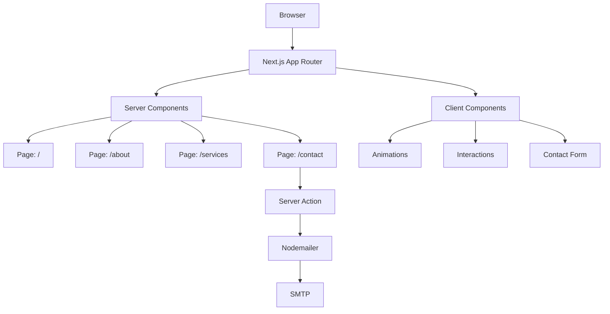

# Architecture

## Overview

Aplikasi Next.js dengan **App Router** menggunakan arsitektur server-client component. Semua rute utama adalah **Server Components** dengan komponen interaktif sebagai **Client Components**.

## Routing

| Route | File | Type |
|-------|------|------|
| `/` | `app/page.tsx` | Server Component |
| `/about` | `app/about/page.tsx` | Server Component |
| `/services` | `app/services/page.tsx` | Server Component |
| `/contact` | `app/contact/page.tsx` | Server Component |
| `/api/contact` | `app/api/contact/route.ts` | API Route |

## Komponen Arsitektur

1. **Layout** (`layout.tsx`) — Header & Footer global
2. **Loading** (`loading.tsx`) — Loading state global
3. **Not Found** (`not-found.tsx`) — Halaman 404

## Alur Data

- **Static Generation** — Semua halaman di-build sebagai static HTML
- **Server Actions** — Form kontak menggunakan server action Next.js
- **No Database** — Situs murni statis tanpa database

## Lihat Juga

- [[tech-stack|Tech Stack]]
- [[modules|Modul Aplikasi]]
- [[features|Fitur]]
